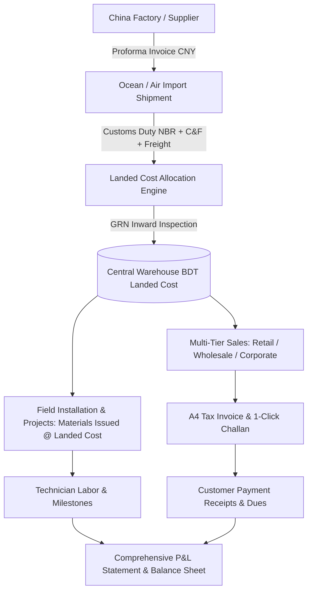

# Apex Enterprise ERP — Bangladesh IT & CCTV Import Management Suite 🚀

A production-ready Enterprise Resource Planning (ERP) application engineered for Bangladesh businesses importing IT, networking, security, CCTV, data center, and electronics products from China.

---

## 🌐 কীভাবে অ্যাপটি ভিজিট করবেন (How to View the ERP)

সার্ভারটি বর্তমানে আপনার কম্পিউটারে ব্যাকগ্রাউন্ডে চালু আছে:

👉 **ব্রাউজার লিংক:** [http://localhost:3000](http://localhost:3000)

আপনার ব্রাউজারে (Chrome / Edge / Firefox / Brave) লিংকটি ওপেন করলেই সম্পূর্ণ ইআরপি সিস্টেমটি লাইভ দেখতে পাবেন!

### ⚡ ওয়ান-ক্লিক স্টার্টার (Desktop Launcher)
ভবিষ্যতে যেকোনো সময় সিস্টেমটি চালাতে চাইলে প্রোজেক্ট ফোল্ডারে থাকা **`run-erp.bat`** ফাইলটিতে ডাবল ক্লিক করুন। এটি স্বয়ংক্রিয়ভাবে সার্ভার রান করে ব্রাউজারে সাইটটি ওপেন করে দেবে।

---

## 🏢 সম্পূর্ণ বিজনেস লাইফসাইকেল (Full End-to-End Flow)

---

## 🌟 ১১টি কোর মডিউল (11 Core Modules)

| # | মডিউল (Module) | প্রধান বৈশিষ্ট্য (Key Capabilities) |
|---|---|---|
| 1 | **Executive Dashboard** | রিয়েল-টাইম রেভিনিউ, ক্যাশ পজিশন, স্টক ভ্যালুয়েশন এবং Section 47 টেস্ট সিনারিও ভেরিফিকেশন। |
| 2 | **Products & Pricing** | মাল্টি-টিয়ার প্রাইসিং (Retail, Wholesale, Project, Dealer) ও চায়না পারচেজ প্রাইস বনাম ক্যালকুলেটেড ল্যান্ডেড কস্ট। |
| 3 | **China Imports & Costing** | চায়না প্রফরমা ইনভয়েস, চট্টগ্রাম পোর্ট ডিউটি, ফ্রেইট চার্জ এবং ইন্টারঅ্যাক্টিভ ল্যান্ডেড কস্ট ক্যালকুলেটর (By Qty/Value/Weight/Volume)। |
| 4 | **Warehouse & Stock** | মাল্টি-ওয়্যারহাউস ব্যালেন্স, জিআরএন (GRN) রিসিভিং, বিন এলোকেশন এবং ইমিউটেবল স্টক মুভমেন্ট লেজার (Non-Negative Stock Protected)। |
| 5 | **Serial & Warranty** | প্রতিটি ডিভাইসের বারকোড/সিরিয়াল ট্র্যাকিং (In Stock ➔ Sold ➔ Installed ➔ RMA) ও ওয়ারেন্টি হিস্টোরি অডিট। |
| 6 | **Sales & Invoicing** | কোটেশন ➔ ট্যাক্স ইনভয়েস ➔ ডেলিভারি চালান ১-ক্লিকে কনভার্ট ও প্রফেশনাল প্রিন্টযোগ্য A4 ফরমেট। |
| 7 | **Projects & Field Service** | প্রজেক্ট সাইটে ওয়্যারহাউস থেকে ল্যান্ডেড কস্টে মালামাল ইস্যু, টেকনিশিয়ান শ্রম ও প্রজেক্ট প্রফিটেবিলিটি। |
| 8 | **Customer Directory** | কর্পোরেট, পাইকারি ও খুচরা গ্রাহকদের তালিকা, ক্রেডিট লিমিট, বকেয়া এবং বিআইএন (BIN/TIN) ট্যাক্স নাম্বার। |
| 9 | **China Suppliers Directory** | শেনজেন/গুয়াংজু ফ্যাক্টরি কন্টাক্ট, WeChat আইডি, ইন্টারন্যাশনাল টিটি (TT) ব্যাংক একাউন্ট ও সুইফট কোড। |
| 10 | **P&L & Financial Reports** | আইএফআরএস স্ট্যান্ডার্ড লাভ-ক্ষতির হিসাব (P&L), আমদানির ক্যাশ ফ্লো এবং ওয়্যারহাউস স্টক ভ্যালুয়েশন অডিট রিপোর্ট। |
| 11 | **System Configuration** | ফরেক্স কারেন্সি পেগিং (1 CNY = 16 BDT, 1 USD = 122 BDT), কস্টিং মেথড এবং ৮-রোল সিকিউরিটি পারমিশন ম্যাট্রিক্স। |

---

## 🛡️ ৮-রোল পারমিশন ম্যাট্রিক্স (Role Simulator Switcher)

হেডারের ডানপাশের ড্রপডাউন থেকে যেকোনো সময় ভূমিকা পরিবর্তন করে টেস্ট করতে পারবেন:
1. `SUPER_ADMIN` — পূর্ণাঙ্গ সিস্টেম অ্যাক্সেস।
2. `ADMIN` — অ্যাডমিনিস্ট্রেটিভ ও অপারেশনাল কন্ট্রোল।
3. `PROCUREMENT_OFFICER` — চায়না পারচেজ, শিপমেন্ট ও কস্টিং।
4. `STOREKEEPER` — জিআরএন রিসিভ, বিন ট্র্যাকিং, চালান ইস্যু (লুকানো ক্রয়মূল্য)।
5. `SALES_OFFICER` — কোটেশন, ইনভয়েস ও কাস্টমার ডিউ (লুকানো ক্রয়মূল্য)।
6. `ACCOUNTS_OFFICER` — পেমেন্ট রিসিট, কাস্টমস শুল্ক ও অডিটেড পি&এল।
7. `TECHNICIAN` — প্রজেক্ট মালামাল রিকুইজিশন ও শ্রম লগ।
8. `MANAGEMENT_VIEWER` — পূর্ণাঙ্গ এক্সিকিউটিভ রিপোর্ট ও অডিট ভিউয়ার।

---

## 🧪 Section 47 টেস্ট সিনারিও ভেরিফিকেশন (100% Passed)

- **ইনপুট**: ১০০ পিস CCTV ক্যামেরা @ ৫০০ CNY (¥) + ২,০০,০০০ BDT কাস্টমস ও ফ্রেইট শুল্ক।
- **ল্যান্ডেড কস্ট**: ১০,০০,০০০ BDT (৳১০,০০০ প্রতি পিস)।
- **বিক্রি**: ৩০ পিস রিটেইল (৳৪,৫০,০০০) + ২০ পিস হোলসেল (৳২,৪০,০০০)।
- **মালামাল ইস্যু**: ১০ পিস প্রজেক্টে ইনস্টল (৳১,০০,০০০ ল্যান্ডেড কস্টে)।
- **অবশিষ্ট স্টক**: ৪০ পিস ক্যামেরা (ভ্যালুয়েশন: ৳৪,০০,০০০)।
- **অডিট লেজার**: ৫টি মুভমেন্ট এন্ট্রি (কোনো নেগেটিভ স্টক বা ডেটা ডিসক্রেপেন্সি নেই)।
